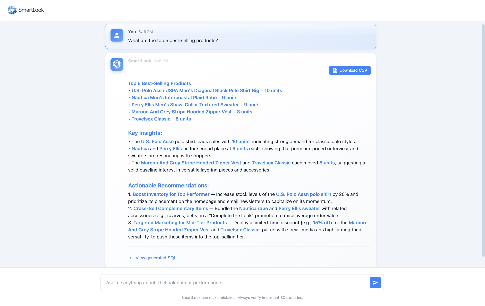
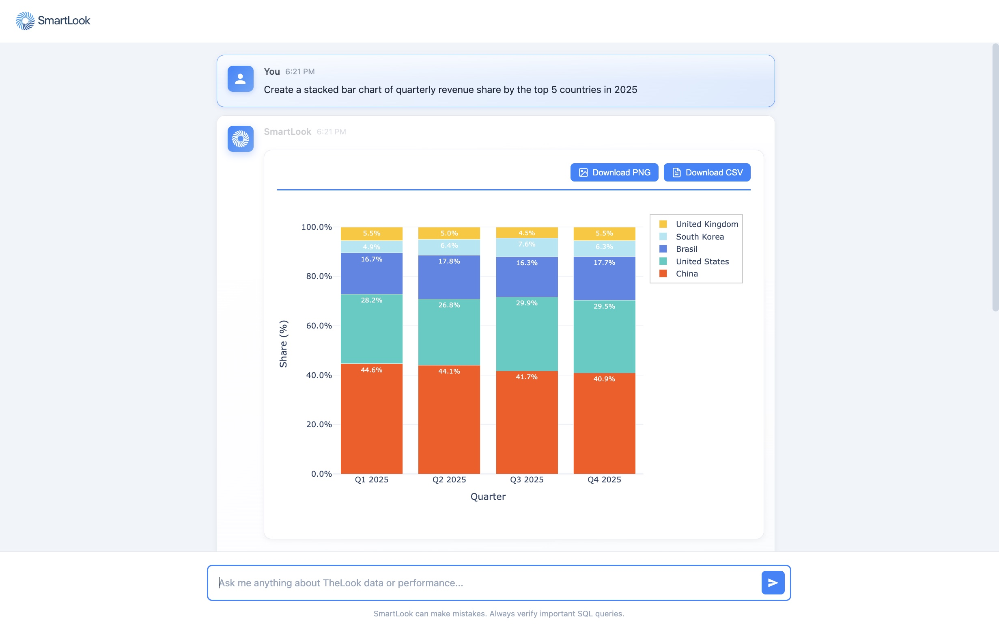
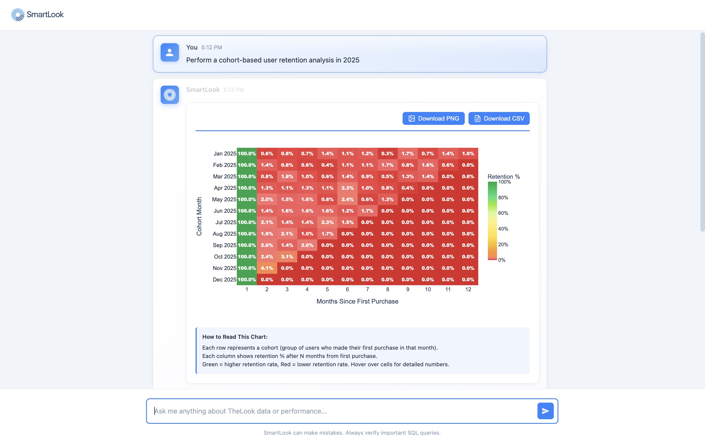
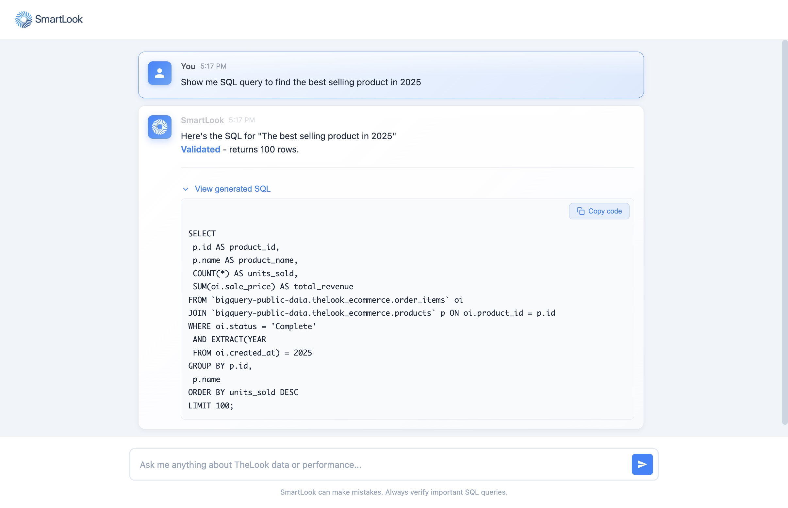

# SmartLook AI Agent

<div align="center">
  


</div>

## Demo

https://github.com/user-attachments/assets/da746a68-1a64-404e-8b11-ed9349c14a3f

## Overview

**SmartLook** is a generative business intelligence and text-to-SQL agent that analyzes datasets from an e-commerce company, detects trends, and generates accurate SQL queries and visualizations to support business analysis tasks. The system features an intuitive JavaScript interface that accelerates insight generation, automates exploratory analysis, and reduces manual effort for analysts.

Try the public demo: [SmartLook AI Agent](https://smartlook-ai-agent.vercel.app/)

## Key Features

- **AI-Powered Analysis**: Leverages LangGraph for structured reasoning and decision-making
- **Automated SQL Generation**: Creates accurate SQL queries using few-shot learning techniques
- **Interactive Visualizations**: Creates dynamic charts and graphs with Plotly.js
- **Fast Insights**: Accelerates data exploration and reduces manual analysis time
- **Modern Web Interface**: Clean, intuitive UI built with vanilla JavaScript for seamless interaction
- **BigQuery Integration**: Direct connection to Google Cloud BigQuery for scalable data processing
- **Conversational AI**: Natural language interface for data queries
- **Export Capabilities**: Download visualizations as PNG and data as CSV for further analysis

## Architecture

SmartLook uses a multi-agent architecture powered by LangGraph:

1. **Data Analyst Agent**: Analyzes data patterns and generates insights
2. **SQL Agent**: Translates natural language queries into optimized SQL
3. **Reasoning Flow**: Structured decision-making process for complex analysis
4. **Few-Shot Learning**: Learns from examples to improve query accuracy

## Run locally

Python 3.12 is pinned in `.python-version`. Install the locked dependencies, then
copy `.env.example` to `.env.local` and fill in your own credentials:

```bash
python3.12 -m venv .venv
source .venv/bin/activate
pip install -r requirements.txt
cp .env.example .env.local
python app.py
```

Open http://127.0.0.1:8000. Local development uses in-memory conversation storage
unless Redis is configured. Real AI requests require `GROQ_API_KEY`,
`GOOGLE_CLOUD_PROJECT`, and a Google service account credential
(`GCP_SERVICE_ACCOUNT_JSON` or `GCP_SERVICE_ACCOUNT`). Configure these in
`.env.local`; the homepage can start without provider credentials.

## Deploy to Vercel

See [the deployment guide](docs/VERCEL_DEPLOYMENT.md) for account setup, required
secrets, Redis, budgets, and validation steps. The public portfolio demo has no
login or access password. Vercel detects `app.py:app` using the Flask preset; no
frontend build command or output directory is needed. After setting environment
variables or connecting Redis, redeploy so the function receives the updated
configuration. Verify a real anonymous chat, not only `/api/health`.

The backend uses Flask, LangGraph, LangChain Groq, BigQuery, Pandas, Plotly,
and SQLGlot. The frontend remains vanilla HTML/CSS/JavaScript with Plotly.js.
Exact dependency versions are committed in `requirements.txt`; update them from
`requirements.in` using `uv pip compile requirements.in --python-version 3.12
--output-file requirements.txt` and run the tests before deploying.

## Project structure

```text
app.py                 Flask routes, anonymous sessions, limits, response handling
agent.py               LangGraph agent, read-only SQL validation, charts
storage.py             Redis sessions, locks, and rate limits
public/assets/         Images and demo assets served by Vercel CDN
templates/index.html   Existing chat frontend
templates/login.html   Legacy template; the public app no longer requires login
requirements.in        Direct dependency constraints
requirements.txt       Locked runtime dependencies
vercel.json            Flask function configuration
.env.example           Configuration template; never put secrets in Git
tests/                 Backend tests and local browser fixture
```

## Tests

```bash
pip install -r requirements-dev.txt
python -m pytest -q
```

For the browser fixture, run `python tests/browser_server.py`, then run
`node tests/browser_smoke.cjs` with Playwright installed and Chrome available.
The fixture binds only to localhost and never calls Groq or BigQuery. It is
excluded from Vercel deployments.

## Usage Examples

### Example 1: Natural Language Query
- User: "What are the top 5 best-selling products?"
- SmartLook: Generates SQL query, executes it, and presents results with insights


### Example 2: Trend Analysis
- User: "Create a stacked bar chart of quarterly revenue share by the top 5 countries in 2025"
- SmartLook: Creates visualization and identifies key patterns


### Example 3: Complex Analysis
- User: "Perform a cohort-based user retention analysis in 2025"
- SmartLook: Performs cohort analysis and detects patterns with actionable recommendations


### Example 4: SQL Generation
- User: "Show me the SQL query to find the best-selling product in 2025"
- SmartLook: Generates SQL query based on user request and validates it


## Features in Detail

### 1. Few-Shot Learning
SmartLook learns from a curated set of query examples to improve accuracy:
- Domain-specific SQL patterns
- Business logic understanding
- Context-aware query generation

### 2. Structured Reasoning
LangGraph enables step-by-step reasoning:
- Query understanding
- Data source identification
- SQL generation
- Data visualization
- Result validation
- Insight extraction

### 3. Error Handling
Robust error handling and recovery:
- SQL syntax validation
- Query optimization suggestions
- Fallback strategies

## Business Impact

- **80% reduction** in time spent writing SQL queries
- **Improved accuracy** through AI-powered validation
- **Faster insights** for data-driven decision making
- **Automated analysis** of recurring business questions
- **Democratized data access** for non-technical stakeholders

## Deployment safeguards

- Public portfolio demo: visitors can start chatting without an account or password.
- Signed, HTTP-only session cookies with isolated Redis conversation histories.
- Atomic session locks plus per-session, per-IP, and daily request limits.
- One read-only query per call, restricted to the known TheLook public tables.
- BigQuery bytes-billed and execution limits, capped result rows and response size.
- Secrets stay server-side; chat text is escaped before rendering HTML.

Use a minimally privileged Google service account. The chat history retains the
last 20 messages per conversation, up to 30 conversations per session, for 24 hours
by default. Text and chart display state are also saved in the browser tab's
session storage; Clear History removes that tab's saved state and its backend history.

## Contributing

Contributions are welcome! Please follow these steps:

1. Fork the repository
2. Create a feature branch (`git checkout -b feature/AmazingFeature`)
3. Commit your changes (`git commit -m 'Add some AmazingFeature'`)
4. Push to the branch (`git push origin feature/AmazingFeature`)
5. Open a Pull Request

## Acknowledgments

- LangChain team for the excellent LLM framework
- Google Cloud for BigQuery infrastructure
- Groq for fast LLM inference
- Open-source community

## Support

For questions, issues, or feature requests:
- Open an issue on GitHub
- Start a discussion in the repository

## License

This project is licensed under the MIT License - see the [LICENSE](LICENSE) file for details.

---

If you find SmartLook useful, please consider giving it a star! ⭐

**Built with dedication for data analysts everywhere** 🚀
